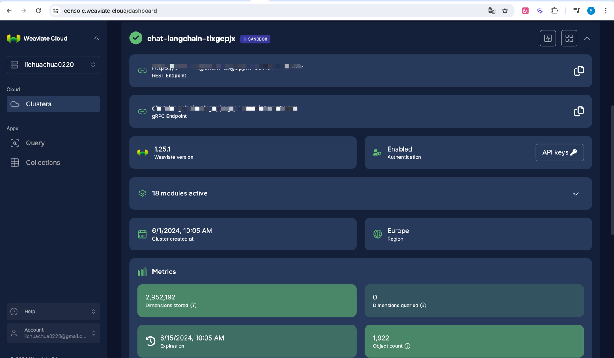
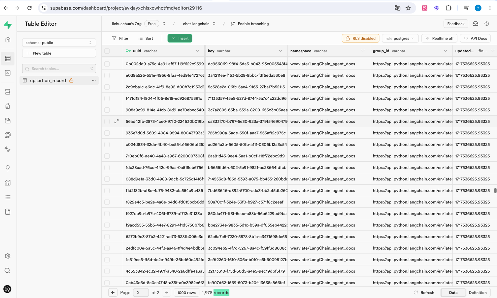
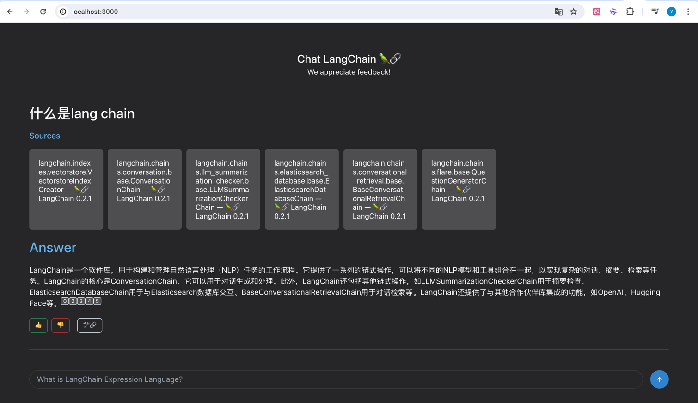
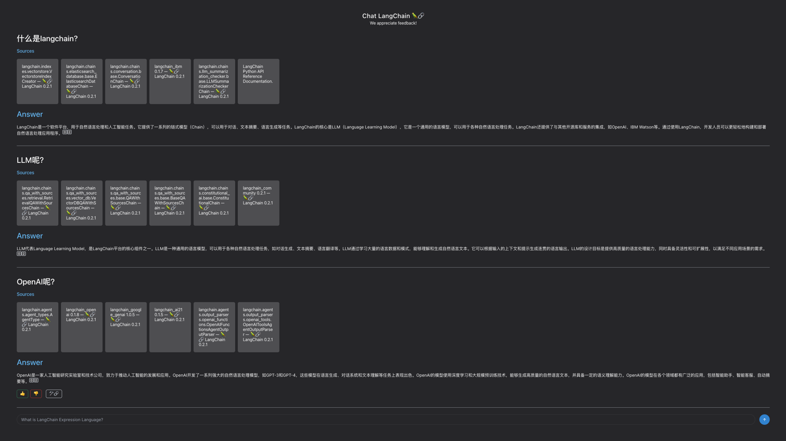

本地运行
1. 修改ingest.py文件中TODO对应的密钥
在项目根目录下运行python ingest.py，会在对应的weaviate生产矢量数据，supabase可以查询记录  


2. 修改main.py文件中TODO对应的密钥
在项目根目录下运行poetry run make start，后端服务运行于 http://127.0.0.1:8080 
3. 进入chat-langchain目录
运行yarn dev，前端服务运行于 http://localhost:3000
4. 浏览器打开前端地址： http://localhost:3000



分析请求：

curl 'http://localhost:8080/chat' \
  -H 'Accept-Language: zh-CN,zh;q=0.9' \
  -H 'Connection: keep-alive' \
  -H 'Content-Type: application/json' \
  -H 'Origin: http://localhost:3000' \
  -H 'Referer: http://localhost:3000/' \
  -H 'Sec-Fetch-Dest: empty' \
  -H 'Sec-Fetch-Mode: cors' \
  -H 'Sec-Fetch-Site: same-site' \
  -H 'User-Agent: Mozilla/5.0 (Macintosh; Intel Mac OS X 10_15_7) AppleWebKit/537.36 (KHTML, like Gecko) Chrome/125.0.0.0 Safari/537.36' \
  -H 'accept: text/event-stream' \
  -H 'sec-ch-ua: "Google Chrome";v="125", "Chromium";v="125", "Not.A/Brand";v="24"' \
  -H 'sec-ch-ua-mobile: ?0' \
  -H 'sec-ch-ua-platform: "macOS"' \
  --data-raw '{"message":"OpenAI呢？","history":[{"human":"什么是langchain?","ai":"LangChain是一个软件平台，用于自然语言处理和人工智能任务。它提供了一系列的链式模型（Chain），可以用于对话、文本摘要、语言生成等任务。LangChain的核心是LLM（Language Learning Model），它是一个通用的语言模型，可以用于各种自然语言处理任务。LangChain还提供了与其他开源库和服务的集成，如OpenAI、IBM Watson等。通过使用LangChain，开发人员可以更轻松地构建和部署自然语言处理应用程序。[0][2]"},{"human":"LLM呢？","ai":"LLM代表Language Learning Model，是LangChain平台的核心组件之一。LLM是一种通用的语言模型，可以用于各种自然语言处理任务，如对话生成、文本摘要、语言翻译等。LLM通过学习大量的语言数据和模式，能够理解和生成自然语言文本。它可以根据输入的上下文和提示生成连贯的语言输出。LLM的设计目标是提供高质量的语言处理能力，同时具备灵活性和可扩展性，以满足不同应用场景的需求。[0][2]"}],"conversation_id":"91bad3fe-72e6-4330-978e-fca37b45ecb8"}'


# 🦜️🔗 Chat LangChain


This repo is an implementation of a locally hosted chatbot specifically focused on question answering over the [LangChain documentation](https://langchain.readthedocs.io/en/latest/).
Built with [LangChain](https://github.com/hwchase17/langchain/), [FastAPI](https://fastapi.tiangolo.com/), and [Next.js](https://nextjs.org).

Deployed version: [chat.langchain.com](https://chat.langchain.com)

The app leverages LangChain's streaming support and async API to update the page in real time for multiple users.

## ✅ Running locally
1. Install backend dependencies: `poetry install`.
1. Make sure to enter your environment variables to configure the application:
```
export OPENAI_API_KEY=
export WEAVIATE_URL=
export WEAVIATE_API_KEY=
export RECORD_MANAGER_DB_URL=

# for tracing
export LANGCHAIN_TRACING_V2=true
export LANGCHAIN_ENDPOINT="https://api.smith.langchain.com"
export LANGCHAIN_API_KEY=
export LANGCHAIN_PROJECT=
```
1. Run `python ingest.py` to ingest LangChain docs data into the Weaviate vectorstore (only needs to be done once).
   1. You can use other [Document Loaders](https://langchain.readthedocs.io/en/latest/modules/document_loaders.html) to load your own data into the vectorstore.
1. Start the Python backend with `poetry run make start`.
1. Install frontend dependencies by running `cd chat-langchain`, then `yarn`.
1. Run the frontend with `yarn dev` for frontend.
1. Open [localhost:3000](http://localhost:3000) in your browser.

## ☕ Running locally (JS backend)
1. Follow the first three steps above to ingest LangChain docs data into the vectorstore.
1. Install frontend dependencies by running `cd chat-langchain`, then `yarn`.
1. Populate a `chat-langchain/.env.local` file with your own versions of keys from the `chat-langchain/.env.example` file, and set `NEXT_PUBLIC_API_BASE_URL` to `"http://localhost:3000/api"`.
1. Run the app with `yarn dev`.
1. Open [localhost:3000](http://localhost:3000) in your browser.

## 📚 Technical description

There are two components: ingestion and question-answering.

Ingestion has the following steps:

1. Pull html from documentation site as well as the Github Codebase
2. Load html with LangChain's [RecursiveURLLoader](https://python.langchain.com/docs/integrations/document_loaders/recursive_url_loader) and [SitemapLoader](https://python.langchain.com/docs/integrations/document_loaders/sitemap)
3. Split documents with LangChain's [RecursiveCharacterTextSplitter](https://api.python.langchain.com/en/latest/text_splitter/langchain.text_splitter.RecursiveCharacterTextSplitter.html)
4. Create a vectorstore of embeddings, using LangChain's [Weaviate vectorstore wrapper](https://python.langchain.com/docs/integrations/vectorstores/weaviate) (with OpenAI's embeddings).

Question-Answering has the following steps:

1. Given the chat history and new user input, determine what a standalone question would be using GPT-3.5.
2. Given that standalone question, look up relevant documents from the vectorstore.
3. Pass the standalone question and relevant documents to the model to generate and stream the final answer.
4. Generate a trace URL for the current chat session, as well as the endpoint to collect feedback.

## 🚀 Deployment

Deploy the frontend Next.js app as a serverless Edge function on Vercel [by clicking here]().
You'll need to populate the `NEXT_PUBLIC_API_BASE_URL` environment variable with the base URL you've deployed the backend under (no trailing slash!).
